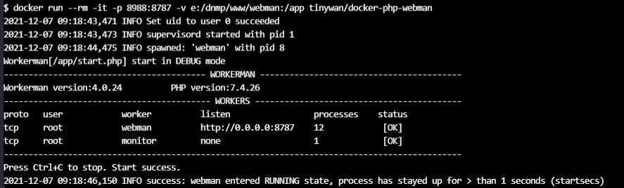

[]()
[]()
[]()
[]()

## Build

```
docker build -t tinywan/docker-php-webman:7.4.29 .
```
## Usage

Start the Docker container:

### Linux

```
docker run --rm -it -p 8787:8787 -v /home/www/webman:/app tinywan/docker-php-webman
```

### Windows

```
docker run --rm -it -p 8787:8787 -v e:/dnmp/www/webman:/app tinywan/docker-php-webman
```

Test Run



> PHP Version **8.1.4**


> **status**


## Extensions

```
bash-5.1# php -m
[PHP Modules]
bcmath       
bz2
calendar     
Core
ctype        
curl
date
dom
event        
fileinfo     
filter       
ftp
gd
hash
iconv        
json
libxml       
mbstring     
mysqli       
mysqlnd      
openssl      
pcntl        
pcre
PDO
pdo_mysql    
pdo_sqlite   
Phar
posix        
readline     
redis        
Reflection   
session      
SimpleXML    
soap
sockets      
sodium       
SPL
sqlite3      
standard     
tokenizer
xml
xmlreader
xmlwriter
Zend OPcache
zip
zlib

[Zend Modules]
Zend OPcache
```
## Other 

delete all container
```
docker rm `docker ps -a -q`
```

delete all images
```
docker rmi -f $(docker images -qa)
```


